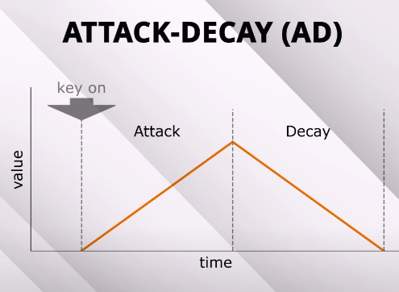
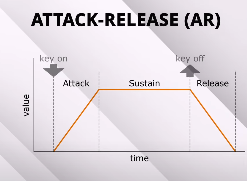
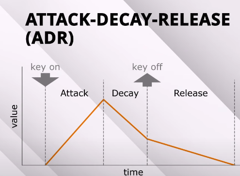
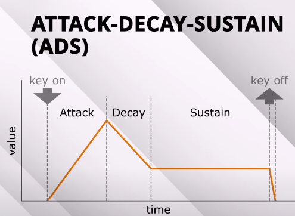
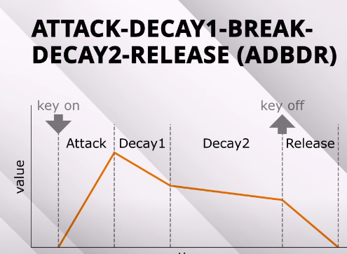

# Amplitude envelopes

Various envelopes exist based on Attack, Hold, Decay, Sustain and Release (AHDSR)

We could have some default envelopers like this, or crate configurable ones with either linear or exponential lines. 

    /\____

## NOTES

### ATTACK DECAY 
    /\

### ATTACK RELEASE  
     ____
    /    \

### ATTACK DECAY RELEASE
     /\_
    /    \

### ATTACK-DECAY-SUSTAIN (ADS)

### ATTACK-DECAY1-BREAK-DECAY2-RELEASE
